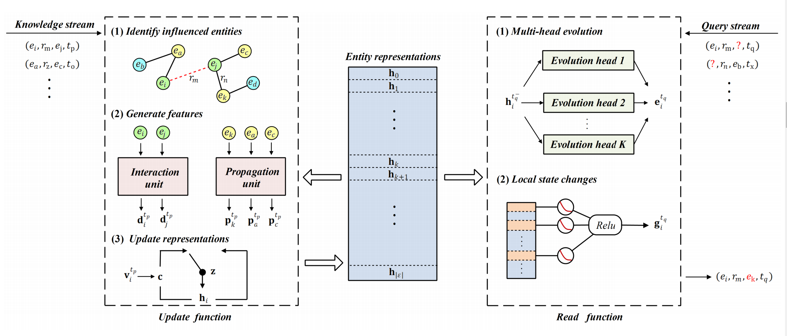

# StreamE
# pytorch implementation of StreamE

Paper: "StreamE: Learning to Update Representations for Temporal Knowledge Graphs in Streaming Scenarios"

Learning representation for temporal knowledge graphs (TKGs)
is a fundamental task. Most existing methods assume that TKGs
cannot be enriched over time, but in the real world, new entities and
relations can be continuously accrued to TKGs as streaming. Due
to the tightly coupled model architectures, these methods either
cannot handle new entities or suffer from high time complexity in
generating representations, making them unfeasible to adapt to the
streaming scenario. 

<p align="center"></p>

In this paper, we propose a StreamE framework
to tackle the above challenges. It aims to learn functions to ma-
nipulate entity representations over time. Specifically, in StreamE
entity representations are decoupled from the model training to
preserve the historical information of entities. An update function
is learned to incrementally update entity representations based on
the newly-arrived knowledge, and a read function is learned to
predict the future trajectory of entity representations to respond
to the queries at arbitrary timestamps. We further propose a joint
training strategy with two temporal regularizations to effectively
optimize the framework. Experimental results on standard TKG
tasks and datasets show that StreamE provides substantial improve-
ments compared with the state-of-the-art methods. Our analysis
also demonstrates that StreamE can tackle the technical challenges
in streaming scenario

If you make use of this code in your work, please cite the following paper:

```
@inproceedings{Zhang2022StreamE,
  title={Temporal knowledge graph representation learning with local and global evolutions},
  author={Jiasheng Zhang, Jie Shao and Bin Cui},
  booktitle={},
  volume = {},
  pages = {},
  year = {}
```

## Contents
1. [Installation](#installation)
2. [Train_and_Test](#Train_and_Test)
3. [Datasets](#Datasets)
4. [Baselines](#Baselines)
5. [Contact](#contact)

## Installation

Install the following packages:

```
pip install torch
pip install numpy
```

Install CUDA and cudnn. Then run:

```
pip install cutorch
pip install cunn
pip install cudnn
```

Then clone the repository::

```
git clone https://github.com/zjs123/StreamE.git
```

We use Python3 for data processing and our code is also written in Python3. 

## Train_and_Test

The user can use the following command to reproduce the reported results of our models, in which the date processing, training and the evaluation are performed automatically.
```
python Main.py -dataset ICEWS14
```
Some of the important available options include:
```
        '-hidden', default = 100, type = int, help ='dimension of the learned embedding'
	'-lr',  default = 0.001, type = float, help = 'Learning rate'
	'-ns', 	 default = 10,   	type=int, 	help='negative samples for training'
	'-dataset', 	 default = "ICEWS14",   	choice=["ICEWS14","ICEWS05","ICEWS18","YAGO"], 	help='dataset used to train'
	'-numOfEpoch', 	default=300,	type=int	help='Train Epoches'
   ```

## Datasets

There are four datasets used in our experiment:ICEWS14, ICEWS05-15, ICEWS18, and GDELT. facts of each datases are formed as "[subject entity, relation, object entity, time]". Each data folder has four files: 

**-train.txt, test.txt, valid.txt:** the first column is index of subject entity, second column is index of relation, third column is index of object entity, fourth column is the happened time of fact.

**-stat.txt:** num of entites and num of relations

The detailed statistic of each dataset
| Datasets   | Num of Entity | Num of Relation | Num of Time | Train | Valid | Test |
|------------|---------------|-----------------|-------------|-------|-------|------|
| ICEWS14 ([Alberto et al., 2018](https://openreview.net/forum?id=pGIHq1m7PU))    | 7,128         | 230             | 365         | 72,826| 8,941 | 8,963 |
| ICEWS05-15 ([Alberto et al., 2018](https://openreview.net/forum?id=pGIHq1m7PU))  | 10,488        | 251             | 4,071       | 38,6962| 46,275| 46,092|
| ICEWS18 ([Zhen Han et al., 2020](https://openreview.net/forum?id=pGIHq1m7PU))  | 23,033       | 256             | 304       | 373,018| 45,995| 49,545|
|YAGO ([Goel et al., 2018](https://openreview.net/forum?id=pGIHq1m7PU))     | 10,038          | 10              | 194         | 51205 |  10973| 10973|

## Baselines

We use following public codes for baseline experiments. 

| Baselines   | Code                                                                      | Embedding size | Batch num |
|-------------|---------------------------------------------------------------------------|----------------|------------|
| TransE ([Bordes et al., 2013](https://papers.nips.cc/paper/5071-translating-embeddings-for-modeling-multi-relational-data))      | [Link](https://github.com/thunlp/OpenKE/tree/OpenKE-PyTorch/openke) | 100, 200       | 100, 200       |
| TTransE ([Leblay et al., 2018](https://dl.acm.org/doi/fullHtml/10.1145/3184558.3191639))    | [Link](https://github.com/INK-USC/RE-Net/tree/master/baselines)                                  | 50, 100, 200   | 100, 200       |
| TA-TransE ([Alberto et al., 2018](https://www.aclweb.org/anthology/D18-1516.pdf))      | [Link](https://github.com/INK-USC/RE-Net/tree/master/baselines)     | 100, 200            | Default    |
| DE-DistMult ([Goel et al., 2020](https://arxiv.org/pdf/1907.03143.pdf))        | [Link](https://github.com/BorealisAI/de-simple)                               | Default            | Default    |
| CyGNet ([Zhu et al., 2021](https://arxiv.org/abs/2012.08492))        | [Link](https://github.com/CunchaoZ/CyGNet)                               | Default            | Default    |
| TNTComplEX ([Timothee et al., 2020](https://openreview.net/pdf?id=rke2P1BFwS))        | [Link](https://github.com/facebookresearch/tkbc)                               | Default            | Default    |
| RE-GCN ([Chenjin et al., 2020](https://arxiv.org/abs/2104.10353))        | [Link](https://github.com/Lee-zix/RE-GCN)                               | Default            | Default    |
| xERTE ([Chenjin et al., 2020](https://openreview.net/forum?id=pGIHq1m7PU))        | [Link](https://github.com/TemporalKGTeam/xERTE)                               | Default            | Default    |

## Contact

For any questions or suggestions you can use the issues section or contact us at zjss12358@gmail.com.

